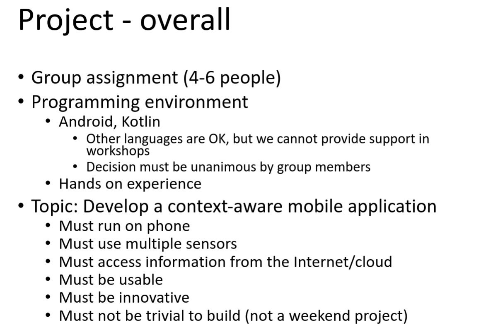

# Boxing Game Idea

I want to make a boxing game for **mobile**, which uses at least 2 sensors.

refer to 

This is the idea which I'm thinking about:

The game will have a map which uses GPS to display other online players

If a gamer wants to challenge another player, they locate them in the map and display their pairing QR code.
The challenge accepter will scan the code & the game will initiate a P2P connection to begin the game.

if the phone is shaked, the game character will receive a power boost.

The tech stack we are thinking is React native, but open to ideas.
